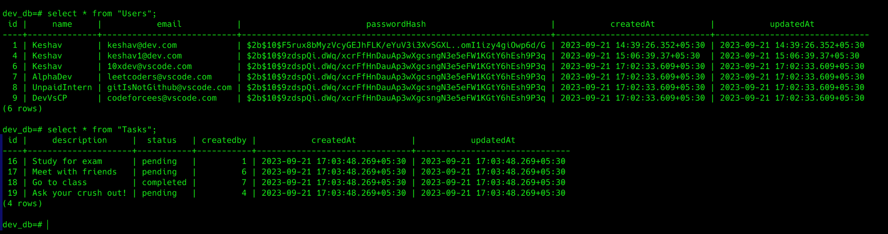

# Task Management API

## Description

- This API can be used for managing tasks. It is a REST API built with Node.js, Express.js and PostgreSQL.
- To manage migrations we have used sequelize-cli and sequelize-orm.
- This API supports JWT authentication and authorization.
- This API follows robus error-handeling, Object Oriented Programming and MVC architecture.

## Local Setup
```bash
    git clone https://github.com/alpha951/Task-management-API.git
    cd Task-management-API
    npm install
```
- Create a .env file similar to ```.example.env``` file and add your environment variables.
- Run ```npx sequelize init```  to setup sequelize.
- Configure your ./config/config.json file to connect to your database.
- Run ```npx sequelize db:migrate``` to run migrations.
- Run ```npx sequelize db:seed 20230921112358-demo-users.js``` to seed the database with users.
- Run ```npx sequelize db:seed 20230921081302-demo-tasks.js``` to seed the database with tasks.

>  #### PASSOWRD for all the users is 1234 in Seeders

## Database Sample


## API Documentation

Following are the API endpoints and their usage.

### Authentication
#### Signup
        - POST
        - http://localhost:3000/api/v1/user/signup
        - BODY : name, email, password
#### Signin
        - POST
        - http://localhost:3000/api/v1/user/signin
        - BODY : name, email, password

### Tasks
    - http://localhost:3000/api/v1/task
#### Create Task
        - POST
        - http://localhost:3000/api/v1/task
        - BODY : description, status
        - HEADER : x-access-token : JWT-TOKEN

#### Get All Tasks
        - GET
        - http://localhost:3000/api/v1/task
        - HEADER : x-access-token : JWT-TOKEN
        
#### Get Task by id
        - GET
        - http://localhost:3000/api/v1/task/:id
        - HEADER : x-access-token : JWT-TOKEN

#### Update Task
        - PATCH
        - http://localhost:3000/api/v1/task/:id
        - HEADER : x-access-token : JWT-TOKEN

#### Delete Task
        - DELETE
        - http://localhost:3000/api/v1/task/:id
        - HEADER : x-access-token : JWT-TOKEN
